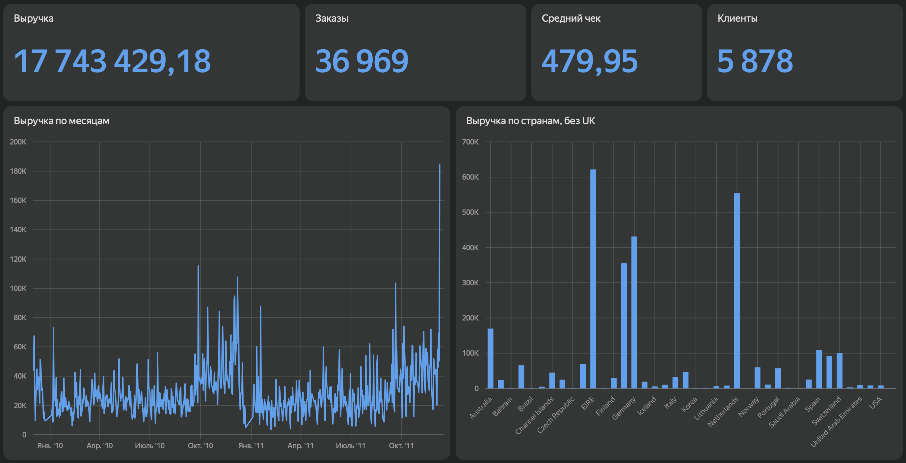
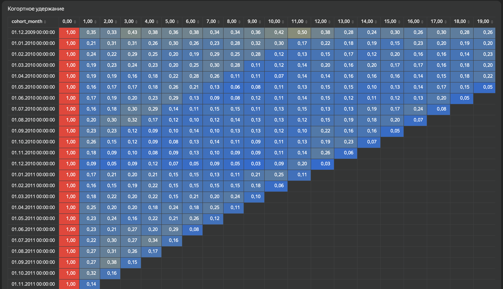

# analytics-platform


Аналитическая платформа на реальных данных: сырьё → витрины (dbt) → A/B и каузальная оценка эффектов → BI-дашборд.
Проект показывает полный цикл работы аналитика: моделирование данных, контроль качества, оркестрация, эксперименты.

> **Данные реальные и открытые.** Backbone — [Online Retail II](https://archive.ics.uci.edu/dataset/502/online+retail+ii) (UCI, CC BY 4.0): ~1,07 млн транзакций британского онлайн-ритейлера за 2009–2011.
> A/B (Модуль C) — реальный рандомизированный эксперимент [Hillstrom / MineThatData](https://blog.minethatdata.com/2008/03/minethatdata-e-mail-analytics-and-data.html), 64 000 клиентов. Это открытые наборы, не продакшн-данные компании; методология и код — рабочие.

---

## Бизнес-выводы и рекомендации

Проект решает задачи двух доменов: e-commerce-ритейл (Online Retail II) и email-маркетинг (Hillstrom). Ниже — что показал анализ и что с этим делать. *(Рекомендации иллюстративные, на открытых данных; допущения указаны явно.)*

**1. Email-кампания окупается — раскатывать.**
Проблема: неясно, даёт ли рассылка эффект или это самоокупаемость активных клиентов.
Анализ (A/B, рандомизация): конверсия +54% (p=0.0002), выручка +$0.424/клиент, эффект причинный.
Рекомендация: запускать кампанию на всю базу как минимум окупаемо.
Эффект: при стоимости письма $0.10 — **ROMI ≈ 324%**.

**2. Не рассылать всем — таргетировать откликающихся.**
Проблема: массовая рассылка тратит бюджет на тех, кому письмо не помогает или вредит.
Анализ (uplift, T-learner): эффект неоднороден — верхний дециль visit-uplift **+0.28**, нижние 3 дециля (~30% базы) **≤ 0** (письмо снижает визиты).
Рекомендация: слать топ-70% по предсказанному uplift, нижние 30% исключить.
Эффект: экономия **~$640** бюджета, отказ от контрпродуктивных отправок ~6 400 клиентам, **ROMI растёт с 324% до ~506%** *(допущение: incremental-выручка сосредоточена в откликающихся сегментах, что подтверждается ≤ 0 uplift внизу)*.

**3. Главный рычаг LTV — удержание первого месяца.**
Проблема: где терять меньше клиентов, чтобы поднять LTV.
Анализ (когортное удержание): после первого месяца возвращается лишь ~15–35% — основной отток происходит сразу.
Рекомендация: вложиться в онбординг и активацию первого месяца (welcome-цепочка, второй заказ), а не в реактивацию давно ушедших.
Эффект: даже +5 п.п. к retention первого периода тянет за собой LTV по всей длине жизни когорты.

**4. Работать с базой через RFM-сегменты, а не единым сообщением.**
Проблема: одинаковая коммуникация для всех клиентов неэффективна.
Анализ (RFM в `dim_customers`): клиенты сильно различаются по recency / frequency / monetary.
Рекомендация: «Чемпионы» (высокие F и M, низкий recency) — upsell и программа лояльности; «В зоне риска» (были частыми, вырос recency) — реактивация; «Новички» — онбординг из п.3.
Эффект: бюджет CRM концентрируется на сегментах с наибольшей отдачей вместо ковровой рассылки.

**Оговорка по концентрации:** ~90%+ выручки Online Retail II приходится на домашний рынок (UK) — это риск концентрации; географическую диверсификацию стоит анализировать отдельно (см. чарт «Выручка по странам»).

---

## Стек

| Слой | Инструмент |
|---|---|
| Хранилище | PostgreSQL (Neon, облако) / Docker Postgres локально |
| Трансформации | **dbt** (staging → marts, тесты, документация) |
| Оркестрация / CI | **GitHub Actions** (cron + ручной запуск, секреты) |
| A/B и статистика | Python: pandas, numpy, statsmodels, scipy (z-тест, bootstrap, power/MDE) |
| Каузальность | propensity score (IPW, регрессионная корректировка), uplift / CATE (sklearn) |
| BI | **Yandex DataLens** (live-подключение к витринам в Neon) |

---

## Архитектура данных

```text
raw.online_retail            сырьё как есть (загрузка из UCI)
        |
        v
stg_online_retail  (view)    очистка: отмены, пустые клиенты, валидные суммы, line_revenue
        |
        v
fct_orders         (table)   факт заказов, грейн = один invoice
        |
        +--> dim_customers      (table)   RFM + когорта по клиенту
        |
        +--> cohort_retention   (table)   матрица удержания: когорта x период
```

Слой `staging` — очистка и sanity-check (убраны отмены `Invoice C%`, строки без `customer_id`, невалидные количества/цены).
Слой `marts` — витрины данных (data marts), готовые для BI и анализа.

---

## Витрины

- **`fct_orders`** — заказы: `order_id`, `customer_id`, дата, страна, число позиций, выручка заказа.
- **`dim_customers`** — RFM по клиенту: recency, frequency, monetary, месяц когорты.
- **`cohort_retention`** — удержание по когортам: `cohort_month`, `period_number`, активные клиенты, `retention_rate`.

Каждая витрина покрыта тестами качества (`not_null`, `unique`).

---

## Оркестрация (CI)

Пайплайн запускается автоматически через **GitHub Actions** (`.github/workflows/dbt.yml`):

- по расписанию — **cron ежедневно** (06:00 UTC);
- вручную — кнопкой **Run workflow**;
- при каждом push в `main`.

Шаги прогона: установка dbt → `dbt debug` → `dbt run` → `dbt test` против облачного Postgres (Neon).
Реквизиты подключения хранятся в **GitHub Secrets** (`NEON_*`) — в коде паролей нет.

---

## A/B-тест (Модуль C)

Полный цикл эксперимента на реальном рандомизированном датасете Hillstrom (`notebooks/Module_C_ab_test.ipynb`):
гипотеза → primary + guardrail метрики → SRM-чек → расчёт MDE/мощности → z-тест с ДИ → непрерывная метрика через bootstrap → разведение статзначимости и экономики (ROMI).

**Сравнение:** Womens E-Mail (treatment) vs No E-Mail (control), по ~21 300 клиентов в группе.

| Метрика | Control | Treatment | Эффект | Значимость |
|---|---|---|---|---|
| Конверсия | 0.57% | 0.88% | **+0.31 п.п. (+54%)** | z=3.78, p=0.0002 |
| Visit rate | 10.6% | 15.1% | +4.5 п.п. (+43%) | p < 1e-40 |
| Spend (ARPU) | $0.653 | $1.077 | **+$0.424** | Welch p=0.001; bootstrap CI [0.15; 0.69] |

**SRM-чек** пройден (p=0.70) — рандомизация валидна. **ROMI** при стоимости письма $0.10 — **~324%**.

**Вывод:** эффект причинный (рандомизация), значимый по всей воронке и экономически выгодный — рекомендация раскатывать. Ограничение: одна вариация против контроля; выбор Mens vs Womens требует отдельного теста.

---

## Каузальная оценка (Модуль D)

Наблюдательная causal inference с валидацией против экспериментальной истины (`notebooks/Module_D_causal.ipynb`), исход — visit:

- Эталон (рандомизация): ATE = **+0.0452**.
- На искусственно смещённой выборке наивная оценка **+0.0591** (завышена).
- **IPW** → +0.0347, **регрессионная корректировка** → +0.0398 — обе вернулись к истине (регрессия точнее, ошибка 0.0054 против 0.0138 у наивной).
- **Uplift (T-learner):** фактический аплифт растёт по децилям от −0.14 до **+0.28** — модель ранжирует отклик, таргетинг топ-сегментов эффективнее ковровой рассылки.

Показывает: propensity-методы восстанавливают причинный эффект при известном смещении, uplift переводит средний эффект в решение «кого таргетить».

---

## BI-дашборд (Модуль E)

Дашборд в **Yandex DataLens**, подключён напрямую к витринам в Neon (live).
[Открыть дашборд](https://datalens.yandex/yucf9ot72cz2h)

Состав: скоркарты (выручка, заказы, средний чек, клиенты), выручка по месяцам (сезонность), выручка по странам (без домашнего рынка UK), тепловая карта когортного удержания.




---

## Результаты dbt-прогона

```text
dbt run  -> PASS=4   (stg_online_retail + 3 витрины)
dbt test -> PASS=8   (ERROR=0)

fct_orders:       36 969 заказов
dim_customers:    5 878 клиентов
cohort_retention: 325 строк матрицы удержания
```

---

## Как запустить

### Вариант 1 — онлайн, без установки (Colab + Neon)
1. Заведи бесплатный Postgres на [neon.tech](https://neon.tech), скопируй connection string.
2. Открой `notebooks/Module_A_online.ipynb` в Google Colab.
3. Вставь connection string в ячейку 2 и прогони ячейки: загрузка данных → `dbt run` → `dbt test` → проверка витрин.
4. A/B: открой `notebooks/Module_C_ab_test.ipynb` и прогони сверху вниз (данные тянутся сами).

### Вариант 2 — локально (Docker + dbt)
```bash
docker compose up -d
python -m venv .venv && source .venv/bin/activate
pip install -r requirements.txt
python load_data.py
cd dbt
dbt run  --profiles-dir .
dbt test --profiles-dir .
```

Профиль `profiles.yml` берёт креды из переменных окружения (`NEON_*`). Реальные строки подключения не коммитятся — только в секретах.

---

## Дорожная карта

- [x] **Модуль A** — dbt + витрины на реальных данных, тесты качества
- [x] **Модуль B** — оркестрация: GitHub Actions (cron + ручной запуск + CI, секреты)
- [x] **Модуль C** — A/B end-to-end на реальном эксперименте (Hillstrom): дизайн, MDE, guardrail, значимость, ROMI
- [x] **Модуль D** — каузальная оценка (propensity score: IPW + регрессионная корректировка) с проверкой против экспериментальной истины + uplift/CATE
- [x] **Модуль E** — BI-дашборд в Yandex DataLens поверх витрин (live-подключение к Neon)

---

## Структура репозитория

```text
analytics-platform/
├── .github/workflows/dbt.yml   CI: запуск dbt по расписанию
├── dbt/                        dbt-проект (модели, тесты, профиль)
│   ├── models/
│   │   ├── staging/            stg_online_retail + источники
│   │   └── marts/              fct_orders, dim_customers, cohort_retention
│   ├── dbt_project.yml
│   └── profiles.yml            креды через env vars (NEON_*)
├── notebooks/
│   ├── Module_A_online.ipynb   dbt + витрины (онлайн-запуск)
│   ├── Module_C_ab_test.ipynb  A/B-тест на данных Hillstrom
│   └── Module_D_causal.ipynb   каузальная оценка + uplift
├── docker-compose.yml          локальный Postgres
├── load_data.py                загрузка Online Retail II
└── requirements.txt
```
